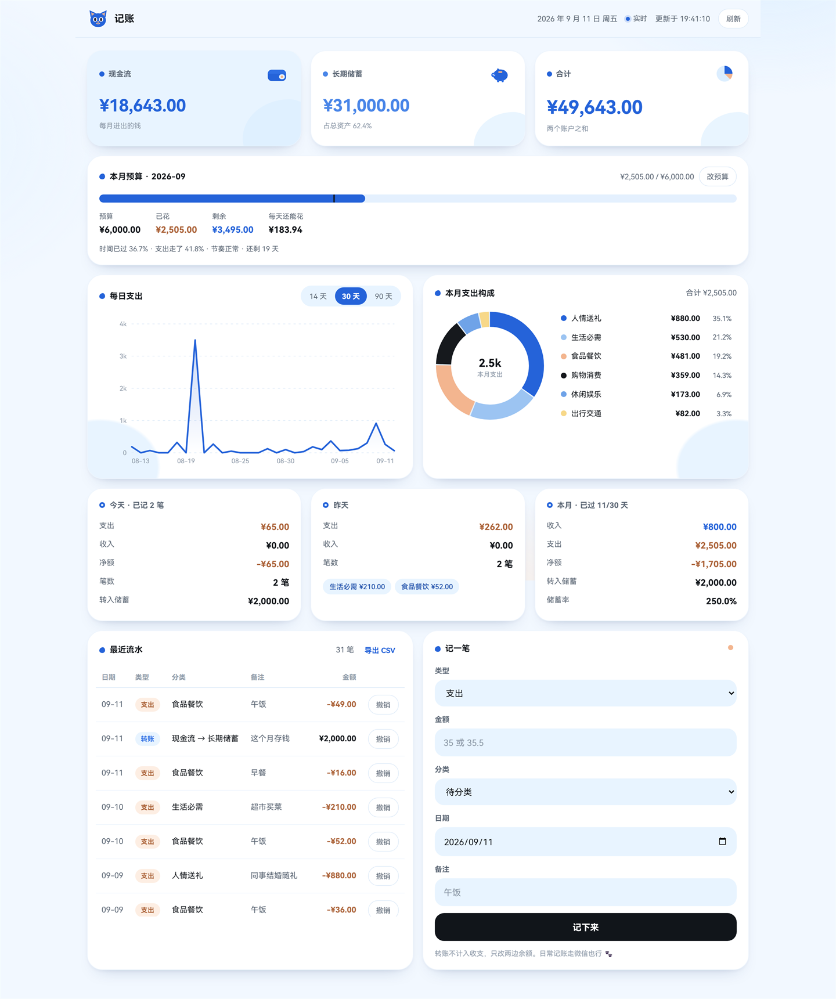

# 记账 · 在微信里说一句话就记好了

把「午饭 35」「发工资 12000」「存了 2000」直接说给一个微信机器人听，
电脑上的记账页面会实时更新；每天开机时，它还会自己推一份日报给你。



> 上图是演示数据，不是真实账目。

---

## 目录

- [这是什么](#这是什么)
- [能做什么](#能做什么)
- [装之前先准备三样东西](#装之前先准备三样东西)
- [安装](#安装)
- [怎么用](#怎么用)
- [常见问题](#常见问题)
- [数据与隐私](#数据与隐私)
- [想改代码的话](#想改代码的话)

---

## 这是什么

一句话：**AI 只负责「听懂人话」，一个跑在你自己电脑上的服务负责「记对账」。**

你在微信里怎么说话都行，AI 把它变成一笔结构化的账（金额、分类、日期、账户），写进本机的一个
SQLite 文件。所有数字——余额、月度合计、分类占比、储蓄率——都由本地服务用 SQL 算出来，
AI 不参与任何算术。这是故意的：**让模型算数是它最容易出错的地方。**

```
你的微信
   │  「午饭 35」「打车 42」「存了 2000」
   ▼
bridge/   微信桥接
   │  收消息 → 先判断「这句像不像账」→ AI 抽取成结构化字段 → 调本机记账服务
   │  只发 HTTP 请求，不碰数据库
   ▼
server/   记账服务（Node + SQLite）
   │  SSE 实时推送 → 网页上的图表和流水立刻更新
   ▼
微信回执 / 每日日报 / 花钱建议
```

**所有东西都跑在你自己电脑上**，账本就是 `data/ledger.db` 一个文件，不依赖任何云数据库。
对外只有两类网络请求：微信机器人接口，和你自己选的 LLM 供应商。

## 能做什么

### 记账

- **微信里说人话就行**：「午饭35」「打车 42」「发工资 12000」「超市买菜 76.5」
- **自动区分三种类型**：支出 / 收入 / 转账。
  「存了 2000」会被认成「现金流 → 长期储蓄」的转账——**存钱不是支出**，
  记成支出会让月度支出虚高、储蓄率失真。
- **自动分类**：生活必需、食品餐饮、购物消费、健康医疗、出行交通、休闲娱乐、人情送礼。
  拿不准的会落到「待分类」，你随时能改。
- **相对时间由服务端换算**：「昨天」「上周三」这类词不交给 AI，那是最容易出错的地方。
- **大额先问一句**：超过阈值（默认 200 元）或 AI 不太确定的，会先回你「是这笔吗」，
  你回「是」才落库。
- **不会重复记账**：用微信的消息 ID 去重，网络重发也只记一笔。
- **AI 挂了也能用**：没配 key 或模型超时，自动降级到服务端规则解析，这句话不会白说。

### 查账（微信里直接问）

| 你发 | 它回 |
| --- | --- |
| `余额` | 现金流 / 长期储蓄 / 合计 |
| `今天` / `昨天` | 当天收支明细汇总 |
| `本月` | 月度报表：分类占比、净额、储蓄率 |
| `最近` / `流水` | 最近几笔流水 |
| `撤销` / `撤销 12` | 撤销最近一笔，或指定某笔 |
| `帮助` | 全部指令一览 |

这些指令**完全不经过 AI**，所以既快又不会出错。

### 网页

打开 <http://127.0.0.1:8787> 就能看到：

- 三张余额卡：现金流、长期储蓄、合计
- 本月预算：花了多少 vs 时间过了多少，两个进度条叠在一起才看得出「花得快不快」
- 每日支出折线图（14 / 30 / 90 天可切）
- 本月支出构成环形图，点分类可以筛选流水
- 今天 / 昨天 / 本月的概况卡
- 最近流水明细，可撤销
- 网页上直接记一笔

微信那边一记完，网页**实时**跟着变（走 SSE 推送，不用手动刷新）。

### 日报

每天早上第一次开机时，自动推一份日报到微信：昨天花了什么、本月进度、余额、以及一两条
花钱建议。**建议来自服务端的确定性规则**，AI 只负责把它翻译成人话，不会凭空编。

机器休眠或关机期间错过的日报不会丢——下次开机时补推，而且一天只推一次，不会刷屏。

### 陪聊（可选，默认开着）

同一个机器人也能陪你聊天，有独立的人设和长期记忆，关机重开还记得你们聊过什么。
不想要就把 `config/bridge.json` 里的 `chat.enabled` 改成 `false`，立刻变回纯记账。

### 命令行

日常运维靠它，网页打不开时尤其有用：

```powershell
.\ledger.ps1 balance                   # 看余额
.\ledger.ps1 list --limit 20           # 看流水
.\ledger.ps1 report month              # 月度报表
.\ledger.ps1 budget set --amount 4000  # 设本月预算
.\ledger.ps1 edit 12 --category 食品餐饮  # 分类记错了直接改
.\ledger.ps1 adjust --to 5000 --note "对账"  # 把余额校准到实际值
```

完整命令列表：`node cli/src/index.js`（不带参数就会打印帮助）。
---

## 装之前先准备三样东西

| 需要 | 说明 | 必须吗 |
| --- | --- | --- |
| **Windows 10 / 11** | 启动脚本是 PowerShell 写的 | 必须 |
| **Node.js 22.5 或更新** | 用了 Node 内置的 `node:sqlite`，低版本没有 | 必须 |
| **微信机器人 token** | 走的是腾讯 iLink Bot API（不是官方开放平台） | 想用微信记账就必须 |
| **一个 LLM 的 API key** | DeepSeek 或智谱 GLM，二选一 | 可选，不配也能用 |

关于最后一项：**不配 key 也能正常记账**，只是会退化成服务端的关键词规则解析，
「午饭35」这种简单句照样认得，复杂一点的句子可能认不出。配一个更省心，
DeepSeek 充值 10 块钱能用很久——每笔记账只调一次模型，一天几毛钱。

**为什么需要 Node.js？** 整个项目**零 npm 依赖**，不需要 `npm install`，
只要装了 Node.js 本身就能跑。

### 装 Node.js

去 <https://nodejs.org> 下载 LTS 版本安装即可（要 22.5 以上）。
装完打开 PowerShell 验证：

```powershell
node -v      # 应该输出 v22.x 或更高
```

---

## 安装

### 第一步：把代码拿到本地

有 git 的话：

```powershell
git clone <这个仓库的地址> 记账
cd 记账
```

没有 git 就在 GitHub 页面上点 **Code → Download ZIP**，解压到任意目录。

> **下载 ZIP 的话必看**：Windows 会给从网上下载的脚本打上「来自其他计算机」的标记，
> PowerShell 会因此拒绝运行 `.ps1`。先解除一下：
>
> ```powershell
> Get-ChildItem -Recurse | Unblock-File
> ```

路径里**可以有中文**，脚本已经处理过了。但**建议不要放在需要管理员权限的目录**（比如 `C:\Program Files`）。

### 第二步：初始化账本

先告诉它你现在有多少钱，这样余额才对得上：

```powershell
.\ledger.ps1 init --initial 8000 --savings 50000
```

- `--initial` = 现金流账户现在有多少（每月进出的钱）
- `--savings` = 长期储蓄账户现在有多少（攒下来的钱）

两个都可以不填，之后用 `.\ledger.ps1 adjust --to 5000` 校准也行。

如果提示「禁止运行脚本」，用这个方式跑：

```powershell
powershell -NoProfile -ExecutionPolicy Bypass -File .\ledger.ps1 init --initial 8000
```

### 第三步：起服务，看看网页

```powershell
npm run serve
```

然后浏览器打开 <http://127.0.0.1:8787>。**先确认网页能用，再去折腾微信**——
这样出问题的时候你知道是哪一半的问题。

到这一步账本是空的，可以先用命令行记两笔试试：

```powershell
.\ledger.ps1 add "午饭35"
.\ledger.ps1 add "存了2000"
```

回到网页刷新一下，应该能看到数据和图表了。

### 第四步：接上微信

微信通道用的是腾讯 **iLink Bot API**，需要扫码拿一个 token。

```powershell
cd bridge
Copy-Item .env.example .env
node test/probe.js      # 先确认接口能通（不需要登录）
npm run login           # 终端会显示二维码，用手机微信扫码
```

扫码成功后终端会打印两行，把它们填进 `bridge/.env`：

```
WEIXIN_BOT_TOKEN=<token>
WEIXIN_ALLOWED_USER_IDS=<你的用户 ID>
```

**第二行是白名单，务必填。** 填了之后只有你自己的微信能记账，
别人给这个 bot 发消息会被直接忽略。

然后回到项目根目录，一条命令同时起「记账服务 + 微信桥接」：

```powershell
cd ..
.\start.ps1
```

用手机给那个 bot 发一句「测试 1 元」，微信里应该会收到回执，网页上也会多一笔。

> 这个脚本是**幂等**的：已经在跑就不会重复启动，双击几次也没事。

### 第五步（可选）：配上 LLM，让它更聪明

在 `bridge/.env` 里填一个 key：

```
DEEPSEEK_API_KEY=sk-xxxxxxxx
```

去 <https://platform.deepseek.com> 注册申请。想用智谱 GLM 就填 `GLM_API_KEY`，
并确认 `config/bridge.json` 里的 `llm.provider` 和它对应。

填完先验证一下（真打模型，但不发微信、不写账本）：

```powershell
cd bridge
npm run live
```

### 第六步：装开机自启

```powershell
.\autostart.ps1            # 安装
.\autostart.ps1 -Status    # 看看装没装
.\autostart.ps1 -Remove    # 卸载
```

装完之后每次开机自动跑，**日报也会在这个时候推给你**。
日志在 `data\logs\` 里。

想停掉全部进程：`.\stop.ps1`。
---

## 怎么用

### 在微信里记账

直接说人话就行，不需要任何固定格式：

```
午饭 35
打车 42 用了优惠券
发工资 12000
超市买菜76.5  支付宝
存了 2000
```

它会回你一句确认，比如「记下了：午饭 ¥35.00 · 食品餐饮」。

几种特殊情况：

- **金额大的时候**，它会先问「是这笔吗？」，你回「是」或「对」才真正落库；回别的就作废。
- **分类拿不准的时候**，会落到「待分类」，之后可以用 `.\ledger.ps1 edit <id> --category 食品餐饮` 改。
- **说错了**，直接发「撤销」，或「撤销 12」撤销指定那一笔。
- **它没听懂**，试试「/记 午饭35」强制按记账处理。

### 在电脑上看

<http://127.0.0.1:8787>，微信一记完网页就跟着变。

- 点环形图上的分类（或右边图例），可以筛选下面的流水
- 折线图右上角能切 14 / 30 / 90 天
- 每笔流水右边有「撤销」
- 「本月预算」卡片点「改预算」能直接在页面上设

### 让机器人陪你聊天

和人设、记忆相关的指令：

| 你说 | 会发生什么 |
| --- | --- |
| `/聊 今天好累` | 强制当闲聊（万一它把你的话当成了账） |
| `/记 午饭35` | 反过来，强制记账 |
| `/记忆` | 看看它记住了你什么 |
| `/记住 我不吃香菜` | 让它专门记一条 |
| `/忘记 xxx` | 删掉记错的那条 |
| `/人设` | 看看它现在是个什么角色 |
| `/清空` / `/重置` | 忘掉最近这段对话 / 连长期记忆一起清掉 |
| `/帮助` | 记账 + 陪聊的指令一次看全 |

人设（名字、性格、说话风格）在 `config/bridge.json` 的 `chat` 段里改，改完重启生效。

---

## 常见问题

**Q：我电脑休眠了，给 bot 发消息还有反应吗？**

没有。微信桥接是跑在你这台电脑上的，电脑睡了它就不在工作，
消息会等在微信服务器那边，不会丢，但**要等电脑醒了才会被处理**。

所以白天**电脑开着（或者至少不休眠）的时候记账最顺**。如果白天电脑关着，
晚上回来开机时 Bot 会把积压的消息一条条处理掉，同时推一份当天的日报。

> 想让它在休眠时也能用，只能把服务放到一台 24 小时开机的机器（比如闲置笔记本、
> 或者一台便宜的云服务器）上。目前这个版本是单机设计。

**Q：每次用都需要在电脑上重启前后端吗？**

不需要。装一次开机自启就行：

```powershell
.\autostart.ps1
```

之后开机自动跑。手动启动用 `.\start.ps1`，它是幂等的，重复跑不会重复起进程。
`.\stop.ps1` 停掉全部。

**Q：日报里能带截图吗？**

**不能。** iLink Bot API 官方实现只支持发文本，没有对外暴露发图片的接口。
日报内容 = 昨天 / 本月 / 余额 / 建议（文字版）。想看图表就打开网页。

**Q：余额对不上了怎么办？**

用实际余额校准：

```powershell
.\ledger.ps1 adjust --to 5000 --note "对账"
```

**Q：会不会重复记账？**

不会。每条微信消息都有唯一 ID，重复处理会被去重键挡掉。

**Q：端口 8787 被占用了？**

```powershell
$env:PORT=8788; npm run serve
```

**Q：怎么改支出分类？**

分类清单在 `server/src/db/categories.js`，是唯一的事实来源。
改完启动时会自动做一次迁移对齐（用版本号守着，只跑一次，不会反复搬动你手工加的分类）。

---

## 数据与隐私

- **账本**：`data/ledger.db`，一个 SQLite 文件，里面的每一笔都是你的。
- **密钥**：`bridge/.env`，里面是微信 token 和 LLM 的 API key。
  **这个文件不要发给任何人**，它已经在 `.gitignore` 里，不会被提交。
- **聊天记忆**：`data/chat-memory.json`。
- **日志**：`data/logs/`（可能包含消息原文）。

这些全都在 `data/` 和 `bridge/.env` 里，**两者都已经在 `.gitignore` 中**，
不会被推到 GitHub。

**备份**：把 `data/ledger.db` 复制走就是完整备份（先 `.\stop.ps1` 再复制最稳妥）。
想要一份干净的快照可以用：

```powershell
.\ledger.ps1 balance    # 确认服务在跑
# 然后停掉服务，直接复制 data\ledger.db
```

**网络**：服务只监听 `127.0.0.1`，同一个 WiFi 下的其他设备也访问不到你的账本。
对外的请求只有两处：腾讯 iLink Bot 接口，和你自己配的 LLM 供应商。
没有遥测、没有统计上报、没有云数据库。

---

## 想改代码的话

### 目录结构

```
记账/
├── start.ps1 / stop.ps1 / autostart.ps1   一键启动 / 停止 / 开机自启
├── ledger.ps1 / ledger.cmd                命令行入口
├── server/          记账服务（Node + SQLite，零依赖）
│   ├── src/db/      表结构、迁移、分类体系
│   ├── src/domain/  金额、时间、解析、统计、预算、信号规则
│   └── test/        144 项单元测试
├── cli/             ledger 命令行
├── bridge/          微信桥接（收发消息 + LLM 抽取 + 陪聊，零运行时依赖）
│   ├── src/handler/ 分流：哪句话走记账、哪句话走陪聊
│   └── src/chat/    陪聊（闸门 + 多轮上下文 + 长期记忆）
├── web/             记账页面（原生 JS + 手写 SVG 图表，免打包）
└── data/            账本与日志（不入版本库）
```

### 几个刻意的设计

- **LLM 不做算术。** 金额、占比、余额全部来自服务端 SQL。
- **LLM 不是 agent。** 每笔账只调一次结构化抽取，不跑 agent 循环、不用工具调用，
  成本比 agent 方案低一个数量级。
- **分类双重锁定。** 提示词给清单 + 落库前服务端强校验，不靠模型自觉。
- **确定性指令不过模型。** 「撤销」「余额」直接匹配，既省钱又不会错。
- **判错的方向是不对称的。** 把账判成闲聊会丢钱，把闲聊判成账只是多问一句——
  所以闸门偏向「宁可多问」。
- **每条消息幂等。** 用微信消息 ID 去重。

### 跑测试

```powershell
npm test                 # 服务端，144 项
cd bridge; npm test      # 桥接，12 个套件
```

### 网页改配色

配色全部是 `web/styles.css` 顶部的 CSS 变量，改 `:root` 里那几个值就行，
图表会跟着变（折线图和环形图都从 CSS 变量取色）。
暗色主题在同文件的 `@media (prefers-color-scheme: dark)` 里。

### 文档索引

| 文档 | 回答什么问题 |
| --- | --- |
| [01-总体架构](docs/01-总体架构.md) | 整个系统怎么串起来，为什么这么选 |
| [02-数据模型与统计口径](docs/02-数据模型与统计口径.md) | 表结构、分类体系、余额和占比到底怎么算 |
| [03-服务API与CLI](docs/03-服务API与CLI.md) | 接口契约、SSE 事件、CLI 命令 |
| [04-自写微信桥接与LLM接入](docs/04-自写微信桥接与LLM接入.md) | 桥接怎么收发消息、LLM 怎么接 |
| [05-实施路线图](docs/05-实施路线图.md) | 做到哪一步了、接下来做什么 |
| [06-同类项目调研](docs/06-同类项目调研.md) | 别人怎么做记账 bot 的 |
| [07-解析规则与置信度](docs/07-解析规则与置信度.md) | 一句话是怎么被解析成账的 |
| [08-LLM选型对比](docs/08-LLM选型对比.md) | 为什么选 DeepSeek / GLM |
| [09-微信陪聊BOT](docs/09-微信陪聊BOT.md) | 陪聊怎么和记账共用同一个 bot |
| [bridge/README.md](bridge/README.md) | 桥接的详细搭建与排障 |

---

## 进度

| 模块 | 状态 |
| --- | --- |
| 微信通道连通 | ✅ |
| 记账内核（服务 + CLI + 数据库） | ✅ 双账户、收支/转账/校准、报表 |
| 网页与图表 | ✅ 余额、日/月概况、折线、环形、流水、实时刷新 |
| 桥接记账闭环 | ✅ 一句话落账、确定性指令、大额确认、降级解析 |
| 日报与建议 | ✅ 开机推送、规则信号驱动 |
| 月度预算 | ✅ 网页卡片 / API / CLI / 日报预警 |
| 微信陪聊 | ✅ 与记账共用同一个 bot，独立记忆与人设 |

**还没做的：**

- 每日自动备份（现在需要手动复制 `data/ledger.db`）
- 网页上的「余额校准」入口（命令行已经能做）
- 账单导入（把支付宝/微信账单批量导进来）

**已知做不到的：** 日报里带截图，原因见上面的常见问题。